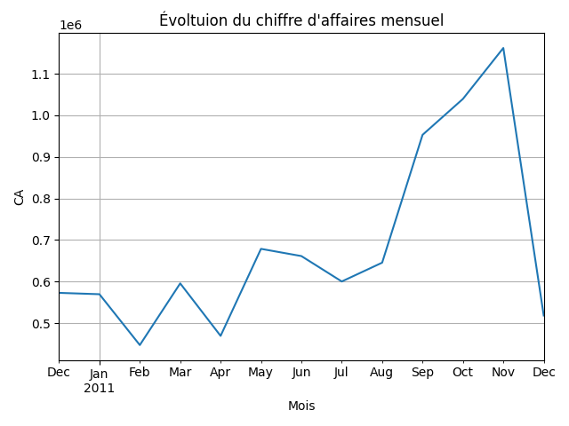

# 📊 Projet Signature — Analyse e-commerce

## 🎯 Objectif
Analyser un dataset réel de ventes e-commerce afin d’identifier les performances commerciales, les clients clés et les tendances dans le temps.

---

## 🛠️ Technologies utilisées
- Python
- Pandas
- Matplotlib

---

## 📁 Structure du projet
projet-signature-ecommerce/
- data.csv → dataset réel
- analyse.py → script d’analyse
- graph_ca_mois.png → graphique

---

## ▶️ Lancer le projet

```bash
pip install pandas matplotlib
python analyse.py
```

---

## 🧹 Nettoyage des données
- Suppression des valeurs manquantes
- Suppression des quantités négatives
- Suppression des prix nuls
- Conversion des dates

---

## 📊 Analyses réalisées

- Chiffre d’affaires total
- Nombre de transactions
- Panier moyen
- Analyse par pays
- Analyse des meilleurs clients
- Analyse des produits les plus vendus
- Analyse temporelle (mensuelle)

---

## 📈 Évolution du chiffre d'affaires


---

## 📈 Insights

- Le pays le plus rentable a été identifié
- Les clients générant le plus de CA ont été détectés
- Les produits les plus demandés ont été mis en évidence
- Une évolution du chiffre d’affaires a été observée dans le temps

---

## 🧠 Conclusion

Ce projet permet de transformer des données brutes en insights exploitables pour la prise de décision.

---

## 🚀 Améliorations possibles

- Création d’un dashboard interactif
- Analyse prédictive
- Segmentation client avancée

---

## 👤 Auteur

Projet réalisé par Ait-Alia Melvin dans le cadre de mon apprentissage en data analyse.